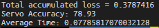

# ECE3432-Final
https://github.com/alexkush2/ECE3432-Final

## Depedencies

The following can be installed via `apt`, and are included in setup.sh:
- `subversion`
- `wget`

The following can be installed via `pip3`, and are also included in `setup.sh`:
- `cython`
- `pandas`
- `numpy`
- `future`
- `pillow`
- `opencv-python`
- `opencv-python-headless`
- `torch`
- `torchvision`
- `matplotlib`

Other:
- [torch and torchvision](https://pytorch.org/get-started/locally/)

## Directions
0. Install pytorch and torchvision
1. Run setup.sh: `sh ./setup.sh`. This installs *most* dependancies.
2. Generate the testing/training files using generateTraincsv.sh: `sh ./generateTraincsv.sh`. This will download the training images.
3. Run the model testing: `python3 rcCarModelTest.py`

### Results

## Configuration

### JSON files contained in /data
JSON files used for setting up training, testing, accuracy test parameters and CUDA support.

### Generate New Testing Data
Run the following script with an argument of how many images you want in your testing dataset
`generateTrainCsv.sh <NumImages>`
